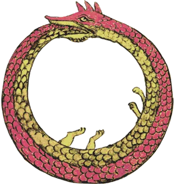

<!-- README.md is generated from README.Rmd. Please edit that file -->

```{r, include = FALSE}
knitr::opts_chunk$set(
  collapse = TRUE,
  comment = "#>",
  fig.path = "man/figures/README-",
  out.width = "100%"
)
```

# orbs

<!-- badges: start -->
[](https://github.com/asshah4/orbs/actions)
[](https://lifecycle.r-lib.org/articles/stages.html#experimental)
[](https://codecov.io/gh/asshah4/orbs?branch=main)
<!-- badges: end -->

The goal of `orbs` is to handle cyclical/harmonic and rhythmic data. The major functionality is to evaluate phasic data using harmonic regressions. It provides support for the basic regression directly, but also implements a [tidymodels](https://www.tidymodels.org/) syntax to be called through [parsnip](https://parsnip.tidymodels.org/). 

Currently, this software has been written in a previous package that was published on CRAN called [`card`](https://CRAN.R-project.org/package=card). However, due to a series of expansions in the software and design choices, that package is being split into two parts. The first deals with cardiovascular data, and this package will instead focus on the rhythm analyses. There will be due notice on the software deprecation.

## On names

Naming things is hard, and this name is partially an acronym (**C**yclical and **R**hythm **B**ased **S**tatistics - yes, the **C** looks like an **O**). It also stems from the Latin word *orbita* which means a "wheel track, beaten path, rut, course" or from the similar word *horbi* which means "turning thing". It also phonetically resembles the symbol *ouroboros*, the snake that bites its own tail. 

```{r, echo=FALSE, fig.retina=4, out.width="30%", fig.align='center'}

```

## Installation

Once it is available, you can install the released version of `orbs` from [CRAN](https://CRAN.R-project.org) with:

```{r, eval=FALSE}
#install.packages("orbs")
```

And the development version from [GitHub](https://github.com/) with:

```{r, eval=FALSE}
# install.packages("devtools")
devtools::install_github("asshah4/orbs")
```
